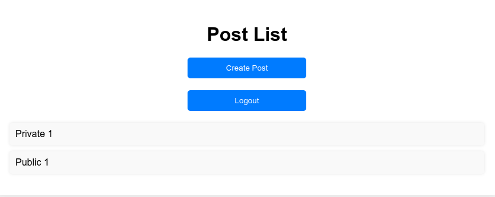
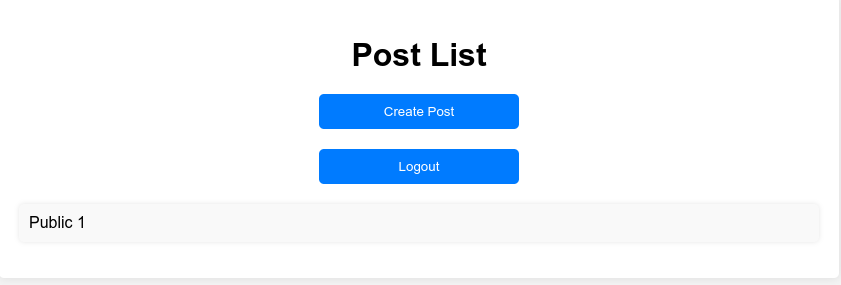
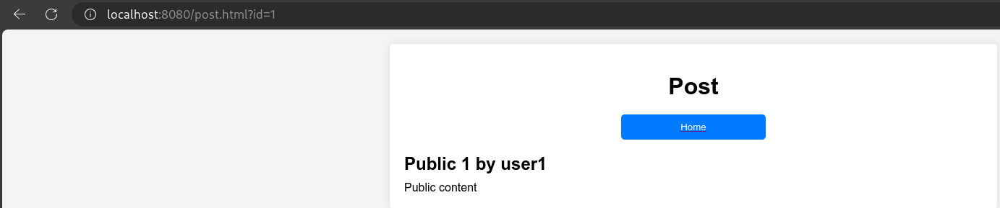
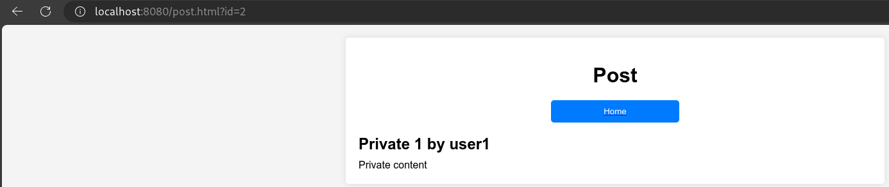

# Proof of Concept: Broken Access Control

## 1. Setup

- Tạo ra 2 user: `user1:passwd` và `user2:passwd` ()
- Đăng nhập bằng **user1** và tạo ra 1 bài post private và 1 bài post
public.

## 2. Exploit

- Sau khi đã đăng hai bài thì ở home page, ta sẽ thấy 2 bài post.

    

- Bây giờ ta sẽ thử đăng nhập bằng **user2**

- Sau khi đăng nhập bằng **user2**, ta sẽ thấy chỉ có 1 bài post public.

    

- Khi click vào post **Public 1** thì thấy được nội dung của post.

    

- Thấy rằng id của post là `1`, nên có thể id của post là dãy số tăng dần.
Từ đó thử thay đổi id của post trong url thành `2`, `3`, `4`, ...

- Khi thay đổi id của post trong url thành `2`, ta sẽ thấy được nội dung của
post private của **user1**.

    
