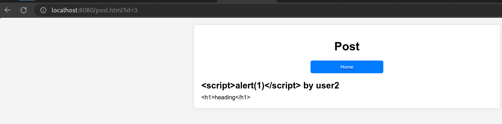

# web-mini

web-mini là một project về dockerize một vulnerable web app.

Trang web cho phép người dùng đăng ký và đăng nhập.

Sau đó người dùng có thể đăng bài, bài đăng có thể là **public** hoặc **private**.

## Vulnerabilities

### 1. Broken Access Control

1. Phân tích lỗi

    Trang web cho phép người dùng đăng bài private, và người khác không thể thấy được các **private post** của người khác.

    Tuy nhiên do `postId` chỉ đơn giản là một chuỗi số tăng dần, cho nên kẻ tấn công có thể truy cập vào endpoint `/api/v1/post/:privateId` để đọc được **private post**.

    Lỗ hổng này là do server không kiểm tra người dùng nào đang truy cập tới bài đăng.

    Trong file `controllers/posts.js`

    ```jsx
    const getPost = async (req, res) => {
        try {
            const id = req.params.id;
            const post = await Post.findOne({ postId: id });
            if (!post) {
                return res.status(StatusCodes.NOT_FOUND).json({
                    error: `Post with id ${id} not found`,
                });
            }
            res.status(StatusCodes.OK).json({ success: true, post });
        } catch (error) {
            res.status(StatusCodes.INTERNAL_SERVER_ERROR).json({
                error: error.message,
            });
        }
    };
    ```

    Đoạn code trên không kiểm tra xem author của bài đăng có đúng là người đang truy cập hay không.

    PoC: [here](./PoC/BrokenAccessControl.md)

2. Đề xuất fix

    Thêm đoạn code kiểm tra xem user truy cập tới bài đăng private có phải là author của bài đăng đó hay không.

    ```jsx
    [...]
    const id = req.params.id;
    const username = req.user.username;
    const post = await Post.findOne({ postId: id });
    if (!post || (!post.public && post.author !== username)) {
        return res.status(StatusCodes.NOT_FOUND).json({
            success: false,
            error: `Post with id ${id} not found`,
        });
    }
    [...]
    ```

    

    Sau khi thêm đoạn code trên, kẻ tấn công sẽ không thể truy cập vào bài đăng private của người khác. Khi truy cập vào bài đăng private của người khác, server sẽ trả về lỗi `Post not found`.

3. Refferences
    - [PortSwigger](https://portswigger.net/web-security/access-control)

### 2. XSS (Cross-site Scripting)

1. Phân tích lỗi

    Trang web cho phép người dùng đăng bài tuy nhiên lại không hề có phương thức để validate **user input.** Bên cạnh đó khi lấy post data từ database để chèn vào html thì lại sử dụng method `innerHTML` khiến attacker có thể chèn tag html và thực thi Javascript.

    Trong file `post.html`

    ```jsx
        fetch(`/api/v1/post/${postId}`)
            .then(response => response.json())
            .then(data => {
                const post = data.post;
                const titleElement = document.createElement('div');
                titleElement.classList.add('post-title');
                titleElement.innerHTML = post.title;
    
                const contentElement = document.createElement('div');
                contentElement.classList.add('post-content');
                contentElement.innerHTML = post.content;
    
                postDetails.appendChild(titleElement);
                postDetails.appendChild(contentElement);
            })
            .catch(error => {
                console.error('Error:', error);
            });
    }
    ```

    Trong file `controllers/posts.js` , ở phương thức `createPost`

    ```jsx
    const createPost = async (req, res) => {
        try {
            const username = req.user.username;
            const { title, content, public } = req.body;
            // Auto increment postId
            const lastPost = await Post.findOne().sort({ postId: -1 });
            let id = 1;
            if (lastPost) {
                id = lastPost.postId + 1;
            }
            const post = await Post.create({
                postId: id,
                title,
                content,
                author: username,
                public,
            });
            res.status(StatusCodes.CREATED).json({ success: true, post });
        } catch (error) {
            res.status(StatusCodes.INTERNAL_SERVER_ERROR).json({
                error: error.message,
            });
        }
    };
    ```

2. Đề xuất fix
    - Validate user input, không cho điền các HTML tag.
    - Encode user input ( ví dụ ‘<’ thành ‘&lt;’ ).
    - Sử dụng `textContent()`, `innerText` thay vì `innerHTML`.
    - Sử dụng Content Security Policy (CSP) để ngăn chặn việc thực thi script từ các domain khác.
    

3. Refferences
    - [PortSwigger](https://portswigger.net/web-security/cross-site-scripting)

### 3. Information Disclosure

Khi truy cập tới API `/api/v1/post/create`

Nếu ta tạo 1 request có body thiếu đi một trường thông tin, ví dụ trường `content`

```json
{
 "title":"Post title"
}
```

Server sẽ trả về một đoạn JSON có thông báo lỗi, trong đó có chứa các thông tin như đường dẫn tới file thực thi, …

```html
<pre>SyntaxError: Expected double-quoted property name in JSON at position 22 (line 3 column 1)<br> &nbsp; &nbsp;at JSON.parse (&lt;anonymous&gt;)<br> &nbsp; &nbsp;at parse (/home/shibajutsu/Hacking/Learn/VDT/mini-web/node_modules/body-parser/lib/types/json.js:92:19)<br> &nbsp; &nbsp;at /home/shibajutsu/Hacking/Learn/VDT/mini-web/node_modules/body-parser/lib/read.js:128:18<br> &nbsp; &nbsp;at AsyncResource.runInAsyncScope (node:async_hooks:206:9)<br> &nbsp; &nbsp;at invokeCallback (/home/shibajutsu/Hacking/Learn/VDT/mini-web/node_modules/raw-body/index.js:238:16)<br> &nbsp; &nbsp;at done (/home/shibajutsu/Hacking/Learn/VDT/mini-web/node_modules/raw-body/index.js:227:7)<br> &nbsp; &nbsp;at IncomingMessage.onEnd (/home/shibajutsu/Hacking/Learn/VDT/mini-web/node_modules/raw-body/index.js:287:7)<br> &nbsp; &nbsp;at IncomingMessage.emit (node:events:519:28)<br> &nbsp; &nbsp;at endReadableNT (node:internal/streams/readable:1696:12)<br> &nbsp; &nbsp;at process.processTicksAndRejections (node:internal/process/task_queues:82:21)</pre>
```

Đây là do các sử lý Exception của server

Trong file `controllers/posts.js` , hàm `createPost`

```jsx
const createPost = async (req, res) => {
    try {
        const username = req.user.username;
        const { title, content, public } = req.body;
        // Auto increment postId
        const lastPost = await Post.findOne().sort({ postId: -1 });
        let id = 1;
        if (lastPost) {
            id = lastPost.postId + 1;
        }
        const post = await Post.create({
            postId: id,
            title,
            content,
            author: username,
            public,
        });
        res.status(StatusCodes.CREATED).json({ success: true, post });
    } catch (error) {
        res.status(StatusCodes.INTERNAL_SERVER_ERROR).json({
            error: error.message,
        });
    }
};
```

Server trả về luôn err cho người dùng.

Tương tự ở các hàm `getPost` ,…

### 4. Các đề xuất của Snyk


Như có thể thấy thì Snyk đã không thể detect được lỗi business logic (Broken Access Control, Information Disclosure).

## Commands

### Docker commands

Sử dụng `docker init`

```bash
docker init
docker compose up --build
```

hoặc

```bash
docker build -t web-mini .
docker run --tag=web-mini --rm -p8080:8080 -it web-mini
```
